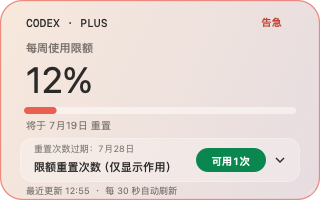

# Codex 使用量卡片

一个原生 macOS 悬浮卡片，用于在桌面上查看 Codex 的 7 天使用额度和限额重置次数。

> 非 OpenAI 官方应用。它仅读取本机 Codex 客户端产生的使用记录，不会发送任何用量数据到网络。


## 功能

- 显示 7 天窗口的剩余额度、重置时间与套餐类型
- 以“充足 / 适中 / 告急”三档颜色反馈余额状态
- 显示限额重置次数和最近到期时间（服务端未提供时会明确提示）
- 静止时收起为 50 × 50 的浮球；悬停后展开卡片
- 仅当 Codex / ChatGPT 桌面窗口可见时显示浮球
- 支持拖动位置与调整卡片尺寸

## 项目亮点

1. **抬眼即见**：把 7 天额度放在桌面上，无需反复打开 Codex 的用量面板。
2. **贴合当前规则**：聚焦官网当前的 7 天窗口，并区分周额度重置与限额重置卡到期时间。
3. **状态一眼分辨**：以“充足 / 适中 / 告急”文字和对应色彩共同表达余额，不只依赖颜色。
4. **低打扰常驻**：静止时收起为 50 × 50 浮球；悬停后才展开完整信息。
5. **跟随工作场景**：仅在 Codex / ChatGPT 窗口可见时显示，避免无关桌面状态下的干扰。
6. **本地优先、开箱即用**：原生 Swift/Cocoa 实现，只读取本机日志；既可下载应用，也可一条命令构建源码。

## 三档状态

| 充足（≥ 60%） | 适中（30–59%） | 告急（＜ 30%） |
| --- | --- | --- |
|  |  |  |

### 收起浮球

| 充足 | 适中 | 告急 |
| --- | --- | --- |
|  |  |  |

## 要求

- macOS 13 或更高版本
- 已安装 Xcode Command Line Tools（提供 `swiftc`）
- 已登录并使用过 Codex 桌面客户端；应用从本机 `~/.codex/logs_2.sqlite` 读取用量响应记录

## 构建与运行

```zsh
git clone https://github.com/nebula-sjk/codex-usage-card.git
cd codex-usage-card
./scripts/build.sh
open "build/Codex使用量卡片.app"
```

首次运行后，卡片会在 Codex / ChatGPT 窗口可见时出现。若没有读到新数据，请先打开 Codex 并发起一次请求。

## 下载已构建版本

在 GitHub 的 **Releases** 页面下载 `CodexUsageCard-macos.zip`，解压后双击应用即可使用。

当前公开构建尚未经过 Apple 签名和公证。若 macOS 阻止首次打开，请在 Finder 中按住 Control 点击应用，选择“打开”，再确认一次即可。你也可以直接从源码构建，以获得本机生成的应用包。

## 隐私与限制

- 不包含 API Key、账户凭据或网络上传逻辑。
- 使用量数据来自本机日志；Codex 的内部日志字段可能随版本变化，卡片会在无法读取时显示相应状态。
- “限额重置次数”的到期时间优先读取服务端字段；字段缺失时只展示明确的兜底或未读取状态。

## 项目结构

```text
Sources/                 Swift 源码
Resources/               应用包资源（Info.plist）
scripts/build.sh         可复现构建脚本
docs/development/        开发记录与历史排查资料
build/                   本地构建产物（不纳入 Git）
```

## 贡献

欢迎通过 Issue 提交兼容性问题、日志字段变化或界面建议。提交前请运行：

```zsh
./scripts/build.sh
```

## 开源许可证

本项目采用 [MIT License](LICENSE)。
